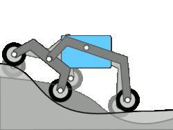

This article will be a glossary for all the buzzwords you'll probably find about the Rover. Most of them will pertain to the 2025-2026 cycle rover, so they may not all apply to what we are doing this year.

## Mechanical
### Steering Methods
#### Differential Steering
Basically just tank turning on a Rover. The current drive mode we use. [Attached](https://www.youtube.com/live/MWcUxFiwad8?t=22128s) is a video of differential steering by Wollongong 

#### Pivot Steering
The wheels rotate (pivot) so that the rover can turn on the spot smoothly. [Attached](https://www.youtube.com/live/MWcUxFiwad8?t=23907s) is a video of pivot steering by Legendary Rover Team in their Autonomy task. This is generally seen as better than differential driving as it does not dig the rover into the sand and also looks super clean (subjective). A majority of teams use pivot steering, althouhg differential steering is still used.

#### Rocker-Bogie
A passive suspension system (used by NASA's Mars rovers) that allows the rover to climb over obstacles much larger than its wheel size while keeping all six wheels on the ground. Not currently used with the Equinox, but was used with the RAT series rovers.

## Arm
#### End Effector
The "hand" or tool at the very end of the arm. On our rover, it's a claw.

#### Degrees of Freedom (DoF)
The number of independent ways the arm can move. A 6-DoF arm can move and rotate to any point in 3D space (our arm currently has 6-DoF).

#### Inverse Kinematics (IK)
The math used to calculate exactly what angle every joint needs to be at to reach a specific coordinate in space. Instead of moving each joint manually, you tell the arm "go to (x, y, z)" and IK does the rest. Our current arm implementation does not and has not implemented inverse kinematics, but optimally it is implemented.

#### Actuator
The motor or component that actually moves the joint.

## Science
### Detection Task
#### Spectrometer
A piece of hardware that measures the properties of light over the electromagnetic spectrum. We use this to identify minerals like **Ilmenite** or detect water in the regolith (sand).

### Material Extraction Task
#### Auger
A screw-like drill used to pull regolith out of the ground to be processed for heating.

#### Heat Rods
A passive tube that moves heat from one part of the rover to another. It's used to keep sensitive electronics warm in freezing environments or to dump excess heat from a power source.

#### Peltier Device
A solid-state "heat pump" that uses electricity to move heat from one side to the other. It's used as a cooler to condense water from the heated up sand.

## Excavator
### Pavers
The pavers are blocks that are used as a sort of floor for the rover to rest on. The pavers are meant to be designed by us to be deployed at the competition.

## Autonomy
### Navigation Hardware
#### LiDAR (Light Detection and Ranging)
A sensor that shoots out thousands of laser pulses to create a 3D "point cloud" map of the surroundings.

#### IMU (Inertial Measurement Unit)
A sensor that tells the rover its orientation (pitch, roll, yaw) and how fast it's accelerating. 

#### Stereo Vision
Using two cameras (like human eyes) to see in 3D. By comparing the images from both cameras, the rover can tell how far away a rock is.

### Navigation Software
#### SLAM (Simultaneous Localization and Mapping)
The process of a rover building a map of an unknown area while simultaneously keeping track of where it is within that map. 

#### Waypoints
Specific GPS or local coordinates that the rover is "ordered" to drive to.

#### Cost Map
A 2D grid of the ground where every "square" is given a score. Flat ground is "low cost" (safe), while big rocks or steep pits are "high cost" (dangerous). The autonomy system looks for the path with the lowest total cost.

#### Path Planning
The "brain" work of calculating the safest and most efficient route from the rover's current position to a waypoint.

#### Loop Closure
A feature of SLAM where the rover recognizes a landmark it has seen before. This allows it to correct any "drift" (errors) in its estimated position

#### URDF
A file that defines how your robot physically looks and moves with XML formatting. It is used for autonomous movements such as with the Autonomy tasks and Arm tasks, to help simulate how the robot would move physically.