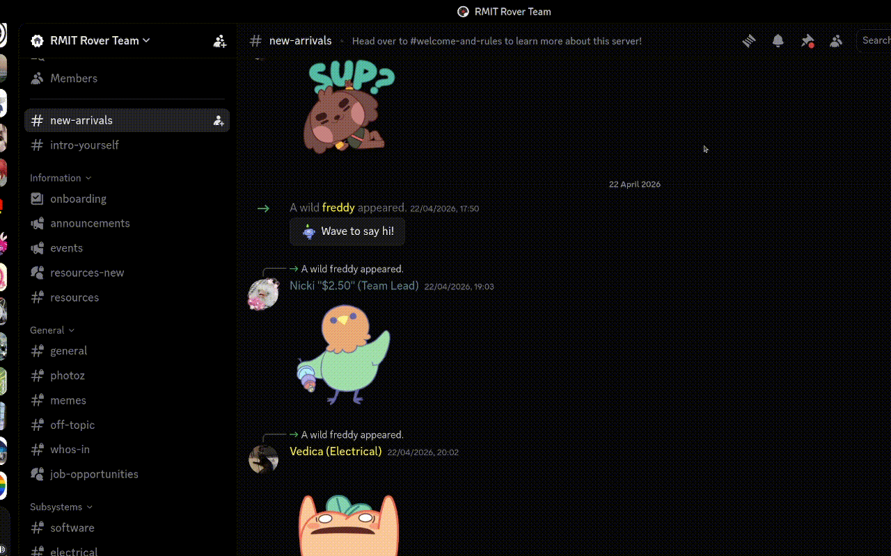
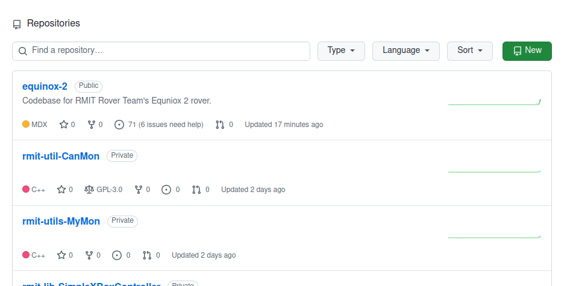
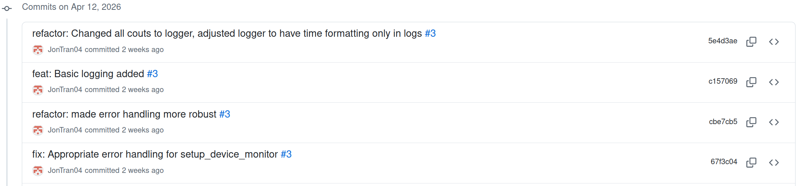
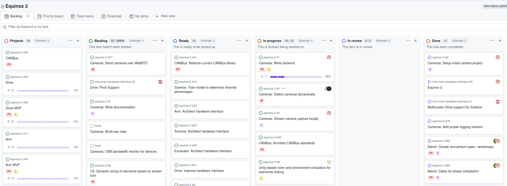
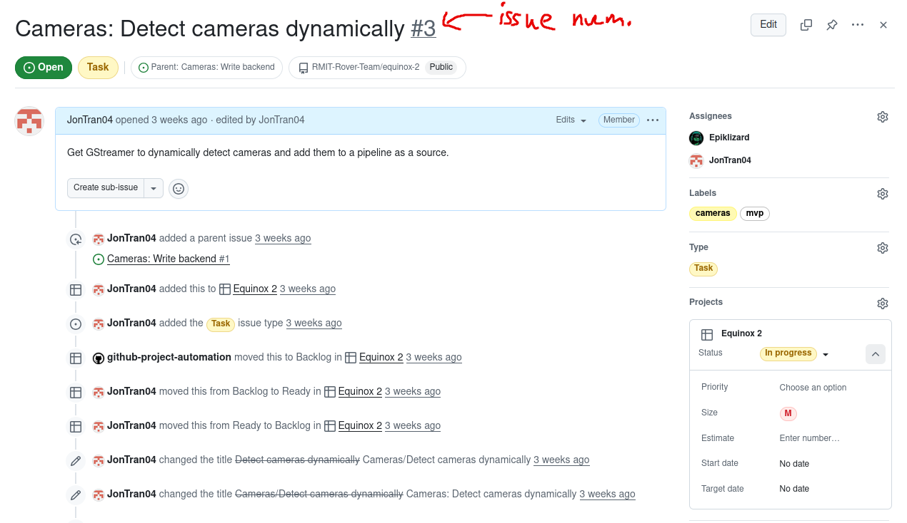

import { Tabs, TabItem } from '@astrojs/starlight/components';
import { Steps } from '@astrojs/starlight/components';


{/* todo: run through SSH keys, add all the users to organization */}
This page will run through the git workshop for Software.

By completing this exercise, you will: 
- Be added to the github organization
- Create an SSH key so your computer can access repositories
- Clone a repo 
- Create and assign yourself to a task 
- Work on a feature branch 
- Make commits linked to an issue 
- Open a Pull Request (PR) 

## Workshop Start
Firstly, what is Git?

Git is an open source version control software system. It allows users to collaborate effectively on projects and maintain version history. We use Git to manage responsibilities (through GitHub Projects), automatically deploy our documentation (through GitHub Actions) and keep everyone up to date with the latest version of our projects.

## Setup GitHub
To get started, we first need to add you to the GitHub repository. Within the appropriate thread in [#software](https://discord.com/channels/891173197951696957/1238080456797323357) (in the discord server), add your GitHub username.  


You will also need to install `git`. How this is done depends on your operating system.

<Tabs>
    <TabItem label="Linux (Ubuntu)">
        <Steps>
        1. Run the comand:
            ```sh
            sudo apt install git
            ```
        </Steps>
    </TabItem>
    <TabItem label="Windows">
        <Steps>
        1. Download the [Git installer](https://git-scm.com/install/windows)
        2. Run the installer.
        </Steps>
    </TabItem>
    <TabItem label="Mac">
        <Steps>
        1. Install Homebrew if you dont have it already, then run:
            ```sh
            $ brew install git
            ```  
        2. Optional:  
            If you prefer a graphical user interface (GUI), [GitHub Desktop](https://desktop.github.com/beta/) includes a command-line version of Git as part of its installation.
        </Steps>  
    </TabItem>
</Tabs>

After this, your Git should be installed. You can confirm this by running:
```sh
git --version
```

Now we need to make an SSH key and link it with GitHub. Follow the [GitHub tutorial](https://docs.github.com/en/authentication/connecting-to-github-with-ssh) on how to do this.
The pages you'll need to follow are:
- ["Generating new SSH key"](https://docs.github.com/en/authentication/connecting-to-github-with-ssh/generating-a-new-ssh-key-and-adding-it-to-the-ssh-agent)
- ["Add a new SSH key"](https://docs.github.com/en/authentication/connecting-to-github-with-ssh/adding-a-new-ssh-key-to-your-github-account)
- ["Test your SSH connection"](https://docs.github.com/en/authentication/connecting-to-github-with-ssh/testing-your-ssh-connection)

These three will link an SSH key with your github account, allowing you to do Git stuff through the terminal.
If you got any problems refer to ["Troubleshooting SSH"](https://docs.github.com/en/authentication/troubleshooting-ssh)

If all this works, you should now be able to run git commands on private repositories within the [GitHub Organization](https://github.com/RMIT-Rover-Team).

## Explaining Git (Cloning, Branching, Project Structure)
#### Repositories
A repository is a data structure that serves as a centralised digital storage space for a project's files and it's entire version history.


Looking at the provided image, each of the cells in the grid is a repository, with it's own version history, and files which are stored.

If you are starting a new project and therefore need a new repository, within your directory, run:
```sh
git init
```
If you are already working with an existing project and therefore the repository already exists, run:
```sh
git clone <repository_link>
```

For this cycle, we will be using a monorepo, meaning everything will be done on one repository, so don't worry about creating new repositories.

#### Commits
Within your repositories, all your changes are split up into "commits". Commits are "snapshots" of your code at a certain point in time. The reason why we want these snapshots of code is because if code breaks, you have a version of your code that works, which you can refer back to.

A very common saying for software development with Git is "Commit early, Commit often". This is because you want as many versions of your code that you can refer back to. Every time you add new functionality, you should commit. Every time you fix a bug, you should commit. Doing this will mean you don't have to redo large portions of code when you've messed up.


Each commit comes with a unique identifier called the SHA-1 Hash. This allows each commit to have a unique key for when you want to refer to it. This identifier can be seen to the right of the commits within the screenshot. Futhermore, all commits SHOULD come with a message describing what the commit changed. Don't leave your commit messages vague like "Changed stuff" or "Fixed code", as it makes it harder for other people to understand what's been changed with each commit.

To commit your changes in your project to GitHub, you can run:
```sh
git add .
```
The `.` indicates the files you want to add to the commit, so in this case, this command adds every changed file to the commit. Typically you will be adding all your changes to the repository, so you'll generally run this command.

To then commit your changes formally, run: 
```sh
git commit -m "<message_name`>"
```
This will make a local commit of all the added files from the previous `git add` command.

To then finally "push" it into the Git servers, run:
```sh
git push
```
This will push the changes, assuming there are no conflicts.

When pushing your changes to Git, you might find that your version is not up to date. If that's the case, you will need to run:
```sh
git pull
```
This will pull all the changes other people may have pushed onto the Git servers. If there are any conflicts with your code and the code you've pulled in, you might need to merge those changes, choosing who's code stays and who's code is deleted.

A lot of this may not make sense, given all the buzz-words, but you'll pick up on Git and understand it after working with it for a bit, so don't be too worried.

#### Branching
do this later
#### GitHub Projects and GitHub Issues
GitHub Projects is a project management tool, which aids in planning and tracking work on GitHub. We'll be using GitHub Projects to help track and plan tasks. 

Each task on GitHub Projects is called an "Issue", so every time you work on a task, it'll be linked to an issue on the Github Project. Your commits can (and should!) be linked to issues by appending the issue number to the end of the Git commit (i.e. `git commit -m "blah blah blah (#67)"` would be linked to issue #67). 


When working on anything, you should always have an issue for it. If it doesn't exist, create an issue (and appropriately give it correct labels) or create a sub-issue of an existing issue if it's a smaller part of a bigger issue and you believe it deserves its own issue.

## Making your first(?) commit
It's time to make your first commits!
<Steps>
1. Clone the tutorial repository.
    ```sh
    git clone git@github.com:RMIT-Rover-Team/workshop-git.git
    ```

2. Create / Assign Yourself to a Task 
    - Go to GitHub → Projects → Git workshop project
    - Find the onboarding parent issue ("Update README.md to include new members") 
    - Create a sub-issue under it, titled: 
        ```
            Add <your-name> to contributors in README.md
        ```
    - Assign the issue to yourself. Apply the appropriate types and labels.

3. Create a new branch for your task: 
    ```sh
    git checkout -b feature/add-<your-name>-readme 
    ```

4. Make a change to Readme
    - Open the README.md file
    - Add your name to the file
    - Commit your change

5. Stage and commit your changes 
    ```sh
    git add .  # This adds every file that has been modified by you to the commit.
    git commit -m "feat: add <your-name> to readme (#123)"   # This makes a "local" commit, along with a message.
    ```
    (Replace #123 with your actual issue number) 

    Push your branch 

    ```sh
    git push origin feature/add-<your-name>-readme 
    ```
6. Open a pull request 

    Go to GitHub → Open a PR 

    Title: 

    ```sh
    Add <your-name> to readme 
    ```
    Description: 
    ```
    Closes <issues_name>
    ```
</Steps>