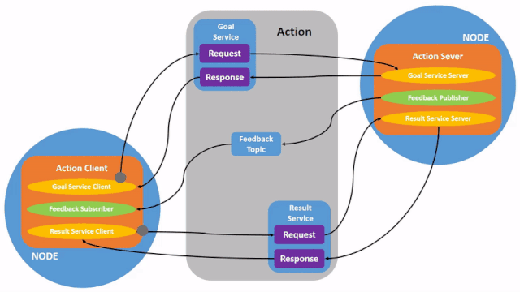

import { Steps } from '@astrojs/starlight/components';
import { Tabs, TabItem } from '@astrojs/starlight/components';
import { FileTree } from '@astrojs/starlight/components';
import { Code } from '@astrojs/starlight/components';

### Learning goals
By completing this exercise, you will: 
- Setup ROS2 Humble 
- Understand the different ways to communicate between nodes
- Understand ROS2’s role in our rover 
- Create a custom message to transmit from one node to another 
- Understand useful ROS2 tools to develop and debug tools

### Prerequisites for workshop
- VSCode or some other IDE installed
- Ubuntu 22.04

### Preamble
A few things to note, before starting this workshop. 

Everything written here will be done in C++, but everything done in C++ is possible in Python on this article. 
Furthermore, a lot of the stuff is referenced from the ROS 2 documentation tutorials, which go further in depth on these topics and are a highly recommended read if you fail to understand anything.
Finally, if you have any more questions, feel free to ask your Software leads / deputy leads! 
## Understanding!
### What is ROS?
The Robotic Operating System, or ROS for short, is a robotics library for building robots. 
At its core, it’s just a messaging library, to send one message from one place to another. 
However, it's main benefits are the large ecosystem of tooling and libraries surrounding ROS, and the fact that everyone already uses it. 

While ROS may or may not be used on our Rover this year, the fundamentals of ROS are universal, and a good understanding of it will help you regardless of what messaging library you use, hence the workshop. 

### What is a ROS Node?
A ROS node is a process that takes data in, works on it, then outputs data in laymans terms. As stated by the ROS documentation, “Each node in ROS should be responsible for a single, modular purpose, e.g. controlling the wheel motors or publishing the sensor data from a laser rangefinder. Each node can send and receive data from other nodes via topics, services, actions, or parameters.” To contextualize this with the rover, there would be a node for the wheel motors, which would manage wheel speeds. 

### Sending messages with nodes 
ROS nodes will need to communicate with each other. You can do that three different ways - topics, services, and actions!  

**Topics** are used for continuous, one-way communication. A publisher can publish a message to a topic, so that all subscribers listening to that topic will receive that message.  

For example, we could have a node for wheels and a node for the base-station computer. The node for wheels would continuously send wheel positions to the base station via the topic. As communication is one way, if the base station wants to send data back to the wheels, another topic would be required, which the base station would publish to, and the wheels would subscribe to.


**Services and clients** are used for non-continuous, call and response communication. Unlike 'topics' which continuously stream data, services only provide data when they are specifically called by a client.

These two are the two main ways to communicate between nodes and are the ones you will be using most (assuming we will be using ROS this year). 

**Actions** use a mix of both services and topics. To put things simply, an action involves a client sending a request to “take an action”. The server will acknowledge this request. While the server node is taking that action, it will continuously return data through its feedback topic. When it’s done, it responds with a result. Actions are also cancelable


This type of messaging is usually the least used in our rover, as currently none of our ROS stuff is automated (at least in anything that isn’t autonomy) and / or is out of scope (the position-based electronics we have don’t have the appropriate encoders to support returning a result, and the velocity-based ones obviously are not based off a goal, but continuous set velocity).
## Setup!
### Setting up your ROS2 environment
To install ROS2:
Run the script by Kaelan, which can be found in the Discord Software chat. This will automatically install ROS2, and source it every time a new terminal is opened (by modifying `~/.bashrc`, a script run every time a terminal is opened). 

Alternatively refer to [the installation guide](https://docs.ros.org/en/humble/Installation.html) to manually install it.

Next, to setup the ROS2 environment:
<Steps>
1. Open up your Ubuntu 22 environment.
2. Open a terminal.
3. In your root directory (`~/` in the terminal), make a new directory called `eq2`. This can be done by running `mkdir -p eq2`.
4. Enter the now created folder by running `cd eq2`.
5. You are now in your new folder called eq2. Git clone the contents of the ROS tutorial repository into your new folder (`git clone <link_of_github_repository>`).
6. You have now setup your ROS2 directory!
</Steps>
### Downloading Zenoh
This year, we are using Zenoh as the middleware for ROS2. In practice, this means that all ROS 2 nodes communicate with each other via Zenoh, replacing the default DDS communication layer:
```sh
sudo apt install ros-humble-rmw-zenoh-cpp
```
You can then switch by using:
```sh
export RMW_IMPLEMENTATION=rmw_zenoh_cpp
```
## Coding!
### Create the ROS2 package!

We will be referring to this [tutorial](https://docs.ros.org/en/jazzy/Tutorials/Beginner-Client-Libraries/Writing-A-Simple-Cpp-Publisher-And-Subscriber.html) for a lot of the following ROS node creation.
Before we get into it, **what is a package?**

ROS2 documentation states a package is:
	"(an) organisational unit for your ROS2 code. If you want to .. install or share your code with others, then you'll need it organised in a package"
In other words, all the code you write will need to be bundled in a package in order to use it with the rest of the system and for other people to run it.

Package creation uses ament as it's build system and colcon as it's build tool. It also uses either CMake or Python officially, which are what we will be mainly using.

Packages consist of:
<Tabs>
	<TabItem label="C++">
	- `CMakeLists.txt` file that describes how to build the code within the package
	- ``include/<package_name>`` directory containing the public headers for the package
	- `package.xml` file containing meta information about the package
	- `src` directory containing the source code for the package
	</TabItem>
	<TabItem label="Python">
	- `package.xml` file containing meta information about the package
	- `resource/<package_name>` marker file for the package
	- `setup.cfg` is required when a package has executables, so `ros2 run` can find them
	- `setup.py` containing instructions for how to install the package
	- `<package_name>` - a directory with the same name as your package, used by ROS 2 tools to find your package, contains `__init__.py`
	</TabItem>
</Tabs>


Now that you (hopefully) understand all there is about packages, time to create one!
The command syntax for creating a new package in ROS 2 is:
```sh
ros2 pkg create --build-type ament_cmake --license Apache-2.0 <package_name>
```
What this does is create an empty baseline package to start working on, depending on whether it's a C++ package or Python package. The `<package_name>` is to be replaced by the package name. Optionally, the --node-name flag can be defined is optional so a node does not need to be defined:

```sh
ros2 pkg create --build-type ament_cmake --license Apache-2.0 --node-name <node_name> <package_name>
```
For now, don't run the --node-name flag, as we will be copying in some example nodes to then run through.
Just like that, you have created your first package!

### Write your first node!
From here we will be working a lot in VSCode on top of the terminal. To open this within the folder you are currently in on Linux, you can run `code .`, with `code` being the VSCode command and `.` being the directory you want to open VSCode in.

Looking at your folder directory, `src/` is where all your C++ custom nodes will go into. To make one, this can be done by creating a file via the terminal by writing `` touch src/<node_name.cpp>``, or alternatively in VSCode just visually doing it. For now we will not be doing that though.

Switch back to the terminal, navigate into `src/` by running `cd src`. Then run the following code
```sh
wget -O publisher_lambda_function.cpp https://raw.githubusercontent.com/ros2/examples/jazzy/rclcpp/topics/minimal_publisher/lambda.cpp
```
This script downloads a ~~trojan virus~~ ROS Node into `src/`. You may notice that the node is different to the one used within the humble tutorial, but the reason why we are not using the humble tutorial's ROS node is because it's slightly less clean.


<Code code={`
	#include <chrono>
	#include <memory>
	#include <string>

	#include "rclcpp/rclcpp.hpp"
	#include "std_msgs/msg/string.hpp"

	using namespace std::chrono_literals;

	class MinimalPublisher : public rclcpp::Node
	{
	public:
		MinimalPublisher()
		: Node("minimal_publisher"), count_(0)
		{
			publisher_ = this->create_publisher<std_msgs::msg::String>("topic", 10);
			auto timer_callback =
				[this]() -> void {
					auto message = std_msgs::msg::String();
					message.data = "Hello, world! " + std::to_string(this->count_++);
					RCLCPP_INFO(this->get_logger(), "Publishing: '%s'", message.data.c_str());
					this->publisher_->publish(message);
				};
			timer_ = this->create_wall_timer(500ms, timer_callback);
		}
	private:
		rclcpp::TimerBase::SharedPtr timer_;
		rclcpp::Publisher<std_msgs::msg::String>::SharedPtr publisher_;
		size_t count_;
	};

	int main(int argc, char * argv[])
	{
	rclcpp::init(argc, argv);
	rclcpp::spin(std::make_shared<MinimalPublisher>());
	rclcpp::shutdown();
	return 0;
	}
`} lang="cpp" title="publisher_lambda_function.cpp"/>
#### Includes
- `#include "rclcpp/rclcpp.hpp` - the rcl in rclcpp stands for ROS Client Library, which has most ROS functionality within it. The cpp stands for C++. If you wanted to use the python equivalent, when working in a python project, you would use `import rclpy`
- `#include std_msgs/msg/string.hpp` This imports a "string message", which is one of the many messages that comes with ROS. This message ONLY contains a string, and nothing else, which is fine for the task, but in future when you need to send multiple values will not be enough.
- `using namespace std::chrono_literals` - This is to make the code more readable, for the timer_ line where 500ms is written. Without this line, you would have to write std::chrono::milliseconds(500), instead of just being able to write 500ms.
#### Publisher Setup
- `class MinimalPublisher : public rclcpp:Node` Every ROS Node will inherit from a `public rclcpp::Node`, which has the base logic for a ROS node.
- `this->create_publisher<std_msgs::msg::String>("topic", 10)` This method is pretty self explanatory. It creates a publisher, with the message type as `std_msgs::msg::String`. It goes on to then define that topic's name as "topic". The final parameter is more difficult, but it's the ROS2 Quality of Service parameter, which in this case the integer 10 is passed in to indicate a queue size of 10 (If the node can't publish faster than the system can send over the network, it will be stored in the queue until it overflows and deletes the oldest message). You can read more about QOS [here](https://docs.ros.org/en/humble/Concepts/Intermediate/About-Quality-of-Service-Settings.html), as it is out of scope for this workshop.
#### Publisher Logic
- The `auto timer_callback` is just a lambda (done with `[this]() ->` syntax), which can then be called by the `timer_`. In baby terms it just defines a function that's assigned to a variable (the variable being `timer_callback`).
- `this->create_wall_timer` is also pretty self explanatory, it just creates a timer that calls the 2nd parameter every period. In this example, it calls the `timer_callback` lambda every 500ms. It's assigned to a variable to manage so we don't just lose it.
#### Making sure ROS boots up. Properly.
- `rclcpp::init(argc, argv);` will initialise ROS to run with `argc` and `argv` as arguments.
- `rclcpp::spin(std::make_shared<MinimalPublisher>());` just runs the ROS node infinitely until something happens to break out of the loop. There's another version of this called `spin_once`, which runs the loop once, then breaks out of it, but we will almost never use it.
- `rclcpp::shutdown()` This is self explanatory. I do not need to explain what "rclcpp::shutdown()" could possibly do.

And just like that, that's all the code for our publisher! If you were following, you should now be able to explain what this code does, and what all the code is responsible. If this is your first time in C++, this might be a lot to take in, but with practice (and a lot of referring to the tutorials) it is very easy to pick up.

But wait... this ROS node won't run just yet. Why is that?


The reason for this is simple. We haven't built the project yet, so our computers can't run any of this code!

Before you can build your code, you will need to tell colcon what dependencies our code runs on (specifically dependencies external to default C++ libraries).

What dependencies do we need? You can currently find what libraries we need in our `#include` section, so which ones aren't part of base C++?

To find the dependencies, modifications will need to be made in both `package.xml` and `CMakeLists.txt`.
#### package.xml
For each dependency, a line needs t be placed called
`<depend><dependency_name></depend>`` (yeah i know this looks confusing deal with it).
So, for example, if I had two dependencies, being `memory` and `string` the `package.xml` would have:
```xml
<depend>memory</depend>
<depend>string</depend>
```
#### CMakeLists.txt
There are multiple things required in CMakeLists.txt. We will continue using `memory` and `string` as the examples.
To start off with, CMakeLists.txt will need to find the dependency. To do this, you use the line 
`find_package(<package_name>)`. For example, to find the memory and string packages you would do:
```cmake
find_package(memory)
find_package(string)
```
Next you need to define the node, and link it to the C++ file you've just "written". This is done with the syntax ``add_executable(<node_name> src/<file_name>.cpp)``.

With this, CMake knows what the node's name will be, and the file the node is referencing, but it does not know the dependencies of the node. The syntax would be as follows: ``ament_target_dependencies(<node_name> <dependency_1> <dependency_2> <dependency_n>)`` (you can have as many dependencies as you want linked to a node)

With the previous dependency example, it would look something like:
```cmake
ament_target_dependencies(publisher memory string)
```

Finally, CMake has all the knowledge to generate the executable file. To generate this file, add to the `CMakesList.txt`:
```cmake
install(TARGETS
	<node_name>
	DESTINATION lib/${PROJECT_NAME})
```
Running `colcon build` after this will build your project! If your CMake was flawless, it should return no errors. To run your newly built ROS node, run ``ros2 run <package_name> <node_name>``, and it should start printing shit! if you fucked it up, it probably won't even build... Figure out the dependencies, then we can reconvene in 10 minutes.

### Writing your second node!
Now you have a node that publishes information into the ROS network. However, you are currently doing nothing with that information. Let's get a subscriber to do something with that information.

Go back into your `src/` directory and run:
```sh
wget -O subscriber_lambda_function.cpp https://raw.githubusercontent.com/ros2/examples/jazzy/rclcpp/topics/minimal_subscriber/lambda.cpp
```
If you were following with the publisher node, you should also be able to understand this node, as a lot of the logic is the same, just with a "subscriber" node instead of a "publisher" node.

A lot of the logic is also shared for dependencies and publishers, so try to get that working.

After implementing this, you should have a file tree that looks like:
<FileTree>

- build/
- include/
- install/
- log/
- src
	- publisher_lambda_function.cpp
	- subscriber_lambda_function.cpp
- CMakeLists.txt
- package.xml

</FileTree>

### Running both of your nodes!
Now that you have both nodes setup, run each one in a separate terminal, with:
```sh
ros2 run <package_name> <node_name>
```
Your publisher should publish string msgs, and the receiver should be receiving them and printing them out.

If you run `rqt_graph` it will also show you a graph of the two nodes, with the topic bridging them. `rqt_graph` is a very useful tool for checking where all your data is flowing!